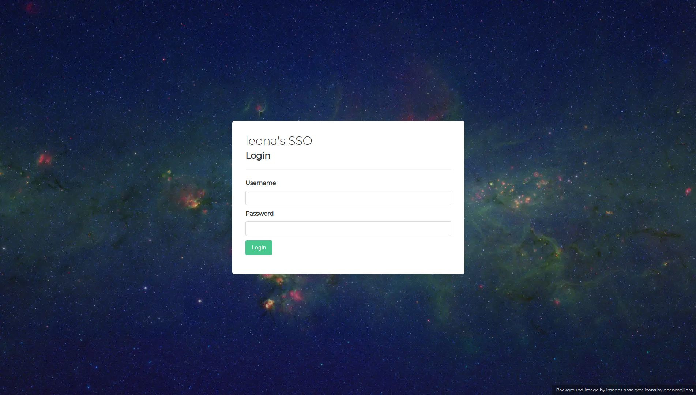
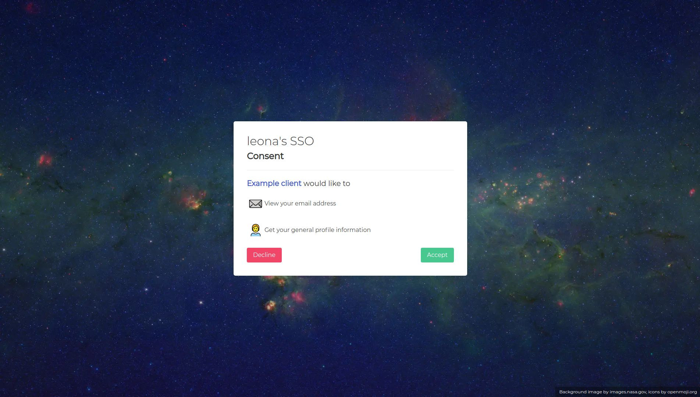

# legitima

legitima is a work in progress LDAP provider for [ORY Hydra](https://www.ory.sh/hydra/). Together with it, it can be used as an OpenID Connect (OIDC) provider to authenticate to any OIDC capable apps. 

## Motivation
I wanted to have an easy and customizable OIDC provider with LDAP capabilities. ORY Hydra fits for my purpose, but ORY Kratos (ORY's Identity Management Software) hasn't got LDAP yet.

## Features and to do
- [x] Login via LDAP
- [x] Simple authentication flow for ORY Hydra
  - [ ] Permission management (only allow users in specific groups access to a client)
- [x] Consent flow for ORY Hydra
- [ ] User Self-Service
  - [x] Personal Data
  - [ ] Security (Password, 2FA)
- [ ] Two-Factor Authentication
- [ ] Admin area
  - [ ] Group management in LDAP and legitima
  - [ ] Client management in ORY Hydra and legitima
- [ ] Better customization
